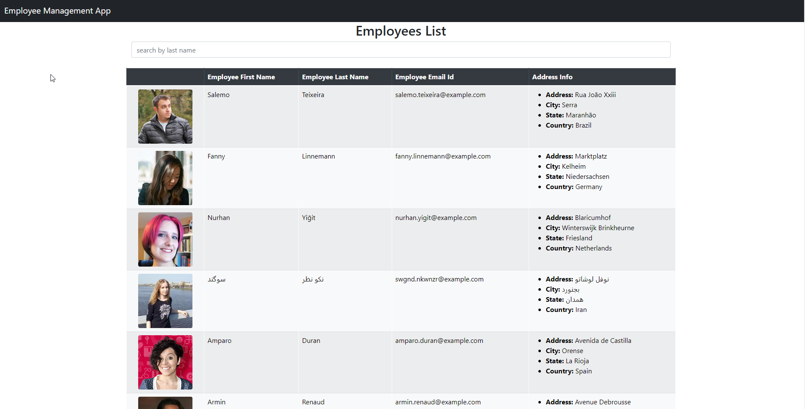

# 14 employee_directory

Employee Directory

## Table of Contents

1.  [Description](#description)
1.  [Screenshots](#screenshots)
1.  [Details](#details)
1.  [Contributing](#contributing)
1.  [Questions](#questions)

## Decription

Created a employee directory with React. This assignment will require you to break up your application's UI into components, manage component state, and respond to user events.

### Screenshot

### Details

Github Repo link:

[Github Repo link](https://github.com/eloy522752868/employee_directory/tree/master)

Web page:

[Link](https://eloy522752868.github.io/employee_directory/)

## Contributing

If like to add to this project or have any question please reach me via my profile below.

## Questions

If you have any question or need to report a issues, please contact me on email below.

[My Profile:](https://github.com/eloy522752868)
